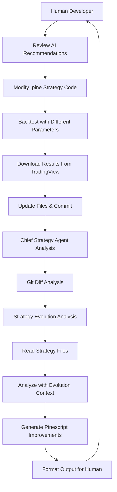

# Strategy Evolution Workflow with Git Diff Analysis

This document describes the enhanced strategy improvement workflow that supports the human Pinescript developer workflow using git diff analysis.

## Overview

The enhanced workflow supports the following human developer cycle:

1. **Human Pinescript Developer** reviews AI agent recommendations
2. **Human** introduces changes into the source code of the strategy
3. **Human** backtests with different parameters according to agent recommendations
4. **Human** downloads backtesting results from TradingView into designated directory
5. **Human** updates the .pine file, produces a commit, and repeats the workflow
6. **Chief Strategy Agent** produces new ideas based on the evolution of files and performance using git diff

## New Components

### 1. Git Analysis Tools (`src/mastra/tools/git-analysis-tools.ts`)

Two new tools have been added to analyze strategy evolution:

#### `analyzeStrategyEvolution`
- Analyzes git diff changes in Pine script strategy files and backtest results
- Compares current state with previous commits (defaults to HEAD~1)
- Detects:
  - Changes in .pine files (code modifications, line additions/removals)
  - Newly added backtest files
  - Modified backtest files
  - Current commit information

#### `getStrategyCommitHistory`
- Retrieves git commit history for a specific strategy and its backtest files
- Returns commit details: hash, message, timestamp, author, changed files
- Supports limiting the number of commits retrieved

### 2. Enhanced Chief Strategy Agent

The Chief Strategy Agent has been enhanced with:

#### New Instructions
- **STRATEGY EVOLUTION ANALYSIS**: Use git diff analysis to understand strategy evolution over time
- **EVOLUTIONARY ANALYSIS WORKFLOW**: Always start with git analysis tools when analyzing strategies
- Focus on historical performance evolution and avoid previously unsuccessful approaches

#### New Tools
- `analyzeStrategyEvolution`: For detecting recent changes
- `getStrategyCommitHistory`: For understanding historical development

### 3. Enhanced Strategy Improvement Workflow

The workflow now includes a new step:

#### Step 1: `analyzeStrategyEvolution`
- Analyzes git changes in strategy files and backtest results
- Uses the Chief Strategy Agent's git analysis tools
- Outputs evolution analysis data for subsequent steps

#### Step 3: Enhanced `analyzeStrategy`
- Now receives evolution analysis data as input
- Includes git diff information in the analysis prompt
- Provides context about:
  - Latest commit information
  - Strategy file changes with diff
  - Newly added backtest files
  - Commit history

## Workflow Process



## Git Diff Analysis Features

### Strategy File Analysis
- Detects code changes between commits
- Counts added and removed lines
- Provides full diff for understanding modifications
- Tracks parameter adjustments and new indicators

### Backtest Results Analysis
- Identifies newly added backtest files
- Compares modified backtest results
- Tracks performance evolution across commits
- Supports multiple file formats (CSV, Markdown, Text)

### Historical Context
- Maintains commit history for strategy files
- Tracks author and timestamp information
- Provides context for decision-making
- Helps avoid repeating unsuccessful changes

## Usage

### Running the Enhanced Workflow

```javascript
// Run with default strategy
const result = await mastra.runWorkflow('strategy-improvement-workflow', {});

// Run with specific strategy
const result = await mastra.runWorkflow('strategy-improvement-workflow', {
  strategyName: 'my-strategy',
  strategiesDir: 'data/strategies',
  backtestsDir: 'data/backtests'
});
```

### Expected Workflow Output

The enhanced workflow provides:

1. **Evolution Analysis**: Git diff information and commit history
2. **Strategy Analysis**: Current performance analysis with historical context
3. **Improvement Recommendations**: Based on both current state and evolution patterns
4. **Implementation Guidelines**: Considering what has been tried before

## Human Developer Integration

### Recommended Git Workflow

1. **Before Changes**: Ensure you're on a clean git branch
2. **After Implementation**:
   ```bash
   git add data/strategies/your-strategy.pine
   git add data/backtests/your-strategy/new-results.csv
   git commit -m "Implement RSI parameter optimization based on agent recommendations"
   ```
3. **Run Analysis**: Execute the strategy improvement workflow
4. **Review Results**: Chief Strategy Agent will analyze the evolution and provide new recommendations

### Directory Structure

```
data/
├── strategies/
│   └── your-strategy.pine
└── backtests/
    └── your-strategy/
        ├── backtest-v1.csv
        ├── backtest-v2.csv
        ├── analysis.md
        └── performance-summary.txt
```

## Benefits

1. **Evolutionary Intelligence**: AI learns from previous attempts and performance
2. **Avoids Repetition**: Prevents suggesting previously failed approaches
3. **Historical Context**: Understands what changes led to improvements or degradation
4. **Performance Tracking**: Links code changes to performance outcomes
5. **Informed Recommendations**: Bases suggestions on actual development history

## Technical Notes

### Git Repository Requirements
- Workflow works with or without git repository
- When git is not available, falls back to current file analysis
- Requires git command-line tools for full functionality

### Error Handling
- Graceful degradation when git is not available
- Continues workflow even if git analysis fails
- Provides warnings for missing git functionality

### Performance Considerations
- Git operations are cached where possible
- Large diff outputs are truncated for performance
- Commit history is limited to relevant files only

## Future Enhancements

1. **Diff Visualization**: Enhanced diff formatting for better readability
2. **Performance Correlation**: Automatic correlation between code changes and performance metrics
3. **Rollback Suggestions**: Recommendations to revert problematic changes
4. **Branch Analysis**: Support for analyzing multiple strategy branches
5. **Automated Testing**: Integration with automated backtesting pipelines